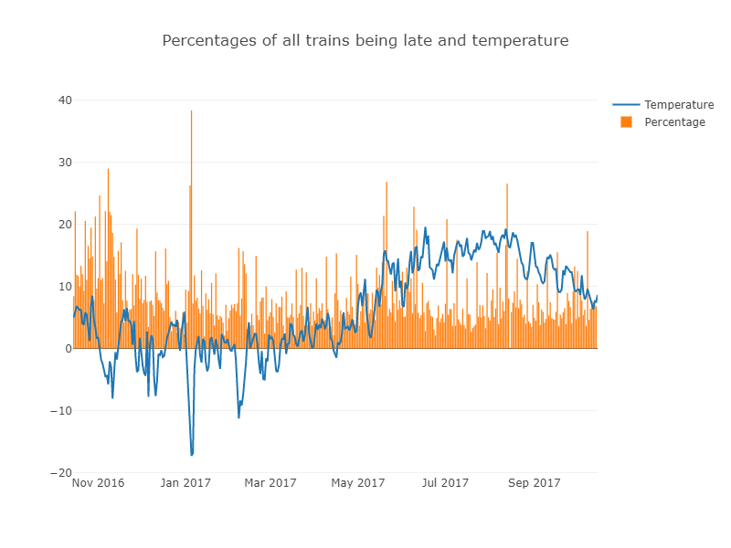
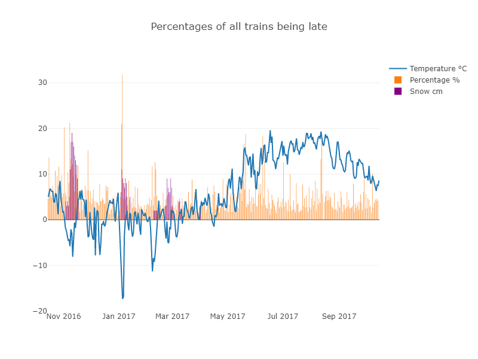
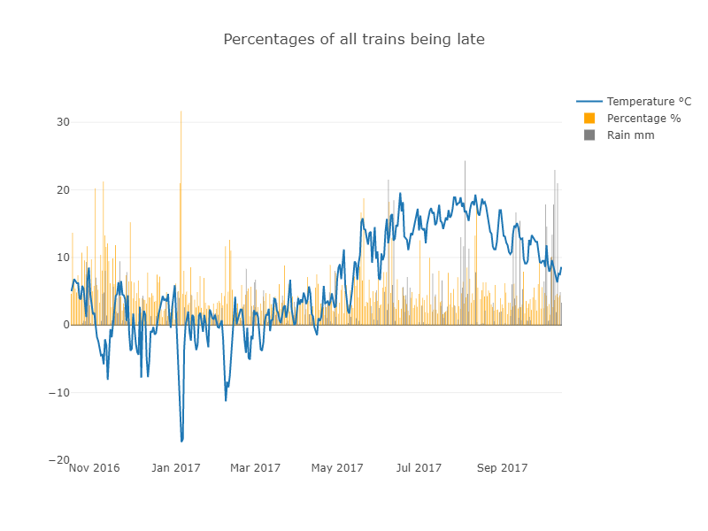
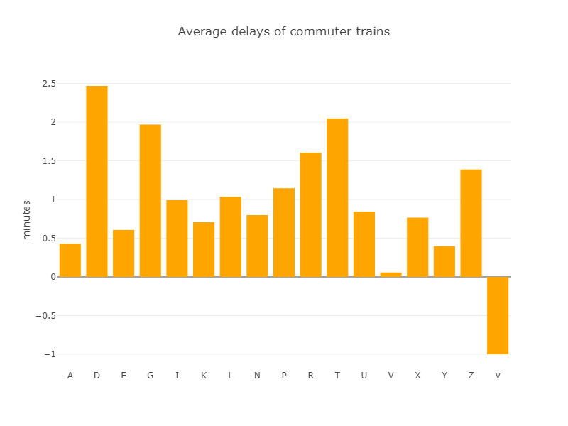
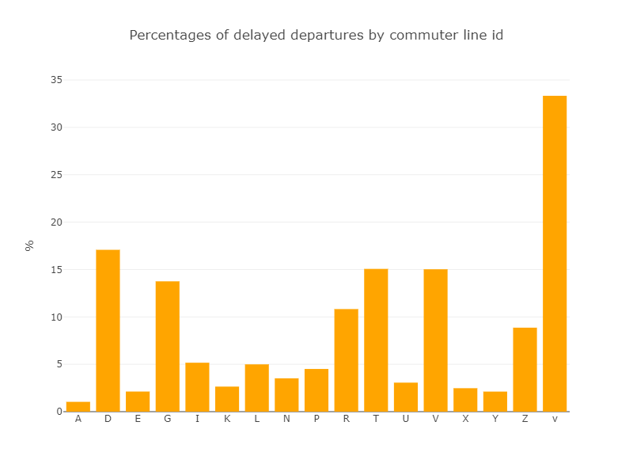
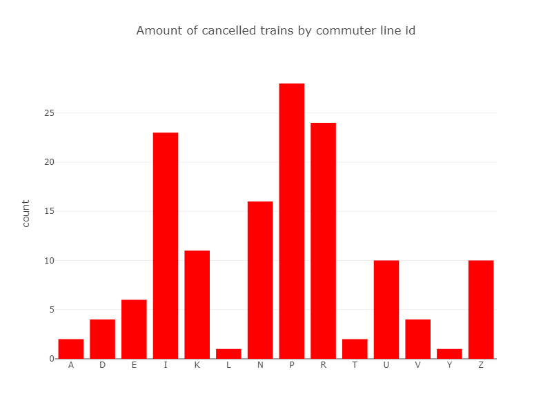

# Application for predicting train delays

## Table of Contents
1. [Data overview](#data-overview)
    1. [Weather data](#weather-data)
    1. [Railway data](#railway-data)
1. [Predictions](#predictions)
1. [Conclusions](#conclusions)

## Data overview

In this section we will give a brief overlook on the data to be analyzed. All the data has been collected from the past year (October 2016 - October 2017).

### Weather data

### Railway data

#### Most common causes for delays

| Delay cause                      | Count | Delay (min)           |
|:---------------------------------|------:|----------------------:|
| Liikenteenhoito                  | 13728 | 6.9                   |
| Matkustajapalvelu                | 11715 | 4.2                   |
| Ratatyö                          | 7253  | 4.9                   |
| Liikenteenhoitojärjestelmät      | 4697  | 9.3                   |
| Muut syyt                        | 2095  | 7.7                   |
| Sähkörata                        | 1700  | 9.8                   |
| Kalusto, moottorijunat ja vaunut | 971   | 10.4                  |
| Rata (ratarakenne)               | 797   | 5.6                   |
| Henkilökunta                     | 656   | 7.6                   |
| Onnettomuus                      | 204   | 23.6                  |
| Aikataulu ja liikennöinti        | 173   | 25.7                  |
| Junanmuodostus                   | 149   | 14.0                  |
| Vetokalusto                      | 45    | 11.2                  |

[More information](https://github.com/finnishtransportagency/metadata/blob/master/csv/delay_codes.csv) about delay causes from finnish tranpost agency 

### Top 10 stations with delays (over 3min)

| Station                          | Count |
|:---------------------------------|------:|
| Päärautatieasema                 | 12404 |
| Pasilan asema                    | 30529 |
| Oulunkylä                        | 11749 | 
| Malmi                            | 11280 | 
| Tikkurila                        | 18087 | 
| Kerava                           | 10374 | 
| Huopalahti                       | 10374 | 
| Puistola                         | 11180 | 
| Hiekkaharju                      | 10342 | 
| Käpylä                           | 10164 | 

Train history data contains 'V' and 'v' trains but they aren't apparently real commuter train lines. [Official commuter train lines listed here](https://aikataulut.reittiopas.fi/linjat/fi/train.html)

## Predictions

We tried many different kinds of models for the data. Our best approach was to make categorical variables and train classifiers with them to make predictions. The classifiers we tried were Gaussian process Classifier, Random Forest Classifier, Dummy Classifier and Support vector classifier. Below we present results from two of them.

Data was not linear and we couldn't make any linear regression analysis. We also tried Polynomial regression analysis with degree 3 kernel for percents (continuous variable), but prediction accuracy dropped significantly (4-25%).

### Random forest classifier (200 trees)

| Train type                       | Accuracy | With random input|
|:---------------------------------|---------|------------------:|
|A                                 |0.93| 0.86|
|D                                 |0.64|0.89|
|E                                 |0.84|0.88|
|G                                 |0.83|1.0|
|I                                 |0.66|0.46|
|K                                 |0.85|0.7|
|L                                 |0.56|0.79|
|N                                 |0.75|0.71|
|P                                 |0.74|0.64|
|R                                 |0.88|0.96|
|T                                 |0.53|0.46|
|U                                 |0.75|0.79|
|X                                 |0.9|0.84|
|Y                                 |0.9|1.0|
|Z                                 |0.7|0.82|

### Support vector classifier (Polynomial degree 3 kernel)

| Train type                       | >5% (Yes/No) |
|:---------------------------------|------:|
| A                                | No |
| D                                | Yes |
| E                                | No | 
| G                                | Yes | 
| I                                | No | 
| K                                | No | 
| L                                | No | 
| N                                | No | 
| P                                | No | 
| R                                | Yes | 
| T                                | Yes | 
| U                                | No | 
| X                                | No | 
| Y                                | No | 
| Z                                | Yes | 

## Conclusions

Making an accurate prediction when trains are late is challenging. Although our graphs show some correlation between weather data and trains being late, the classifiers results were not dependent on weather data. Instead, the classifiers results were based on train data purely, as some train types are more often late than others.
