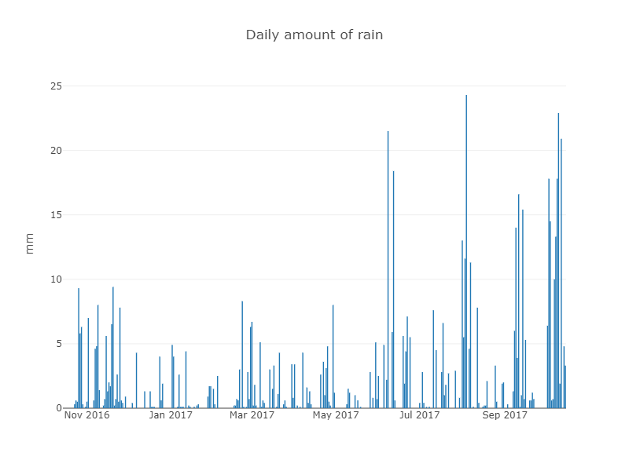

## Application for predicting train lateness

# Table of Contents
1. [Data overview](#data-overview)
    1. [Weather data](#weather-data)
    1. [Railway data](#railway-data)
1. [Predictions](#predictions)
1. [Conclusions](#conclusions)

## Data overview

In this section we will give a bief overlook on the data to be analyzed. All the data has been collected from the past year (October 2016 - October 2017).

### Weather data

### Railway data

*ToDo*

## Predictions

*ToDo*

## Conclusions

*ToDo*